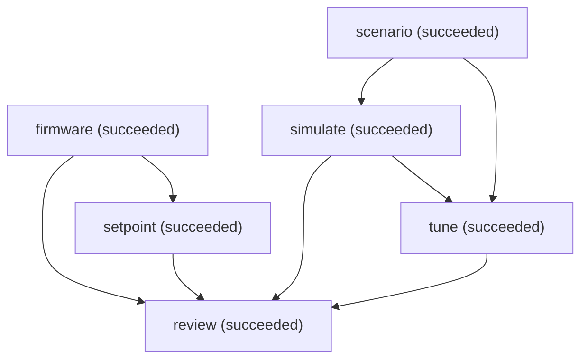

```mermaid
flowchart TD
  firmware["firmware (succeeded)"]
  review["review (succeeded)"]
  scenario["scenario (succeeded)"]
  setpoint["setpoint (succeeded)"]
  simulate["simulate (succeeded)"]
  tune["tune (succeeded)"]
  simulate --> review
  firmware --> review
  tune --> review
  setpoint --> review
  firmware --> setpoint
  scenario --> simulate
  scenario --> tune
  simulate --> tune
```
